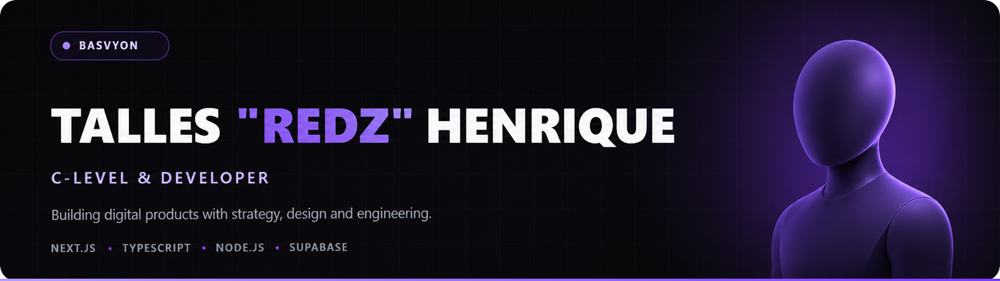

  

  
  
  
  

## About me

- C-Level and Developer at **[Basvyon](https://github.com/basvyon)**, working at the intersection of business, technology and product development.
- Combining executive decision-making with hands-on software engineering.
- Focused on building **reliable digital products, web systems and business automation**.

## Tech stack

<h3 align="center">Frontend</h3>

  

<h3 align="center">Backend, Desktop &amp; Languages</h3>

  

<h3 align="center">Databases</h3>

  

<h3 align="center">Tools &amp; Design</h3>

  

<h3 align="center">Systems</h3>

  

## What I’m building

| Project | Focus | Status |
| :--- | :--- | :---: |
| **Basvyon** | Strategy, technology and development of digital products | Active |

## Current focus

  
  
  

> GitHub already displays the native contribution calendar below this README. I keep this profile focused on real work, current capabilities and the products I’m helping build.

## Let’s build something useful

  I combine technical leadership with hands-on engineering to turn ideas into reliable digital products.
   
  <a href="mailto:onlyredzdev@gmail.com"><strong>Get in touch →</strong></a>

